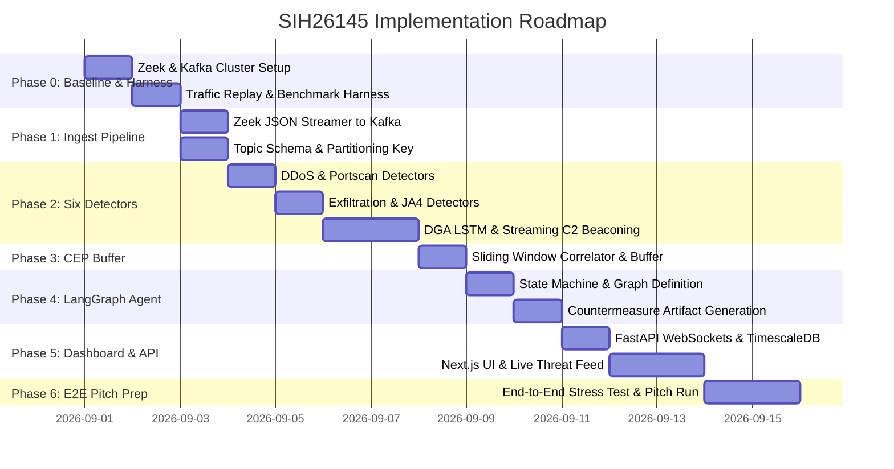
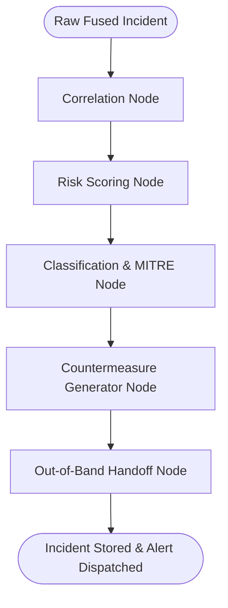

# SIH26145 — Phased Implementation Plan & Engineering Blueprint
### Autonomous Passive Network Threat Detection, Incident Fusion & Out-of-Band Countermeasure Generation for Data Diode Environments

**Sponsoring Organization:** National Technical Research Organisation (NTRO)  
**Theme:** Blockchain & Cybersecurity  
**Target Delivery Date:** 20 September 2026  

---

## 1. System Architecture & High-Level Data Flow

```
                                  =========================================
                                     UNIDIRECTIONAL SECURITY BOUNDARY
                                  =========================================
 [ Production Network Link ]
              │ (Physical Optical Tap / Span Port)
              ▼
   ┌─────────────────────┐
   │ Hardware Data Diode │ (Physical 1-way fiber TX -> RX only, no reverse line)
   └──────────┬──────────┘
              │ (Passive Traffic Mirror)
              ▼
 ╔═════════════════════════════════════════════════════════════════════════╗
 ║                     MONITORING ENCLAVE (READ-ONLY)                      ║
 ║                                                                         ║
 ║   ┌─────────────────────────────────────────────────────────────┐       ║
 ║   │ Layer 0: High-Speed Ingest & Passive Extraction (Zeek)      │       ║
 ║   │ • Connection Logs (conn.log, UID, Community ID)             │       ║
 ║   │ • DNS Query/Response Logs (dns.log, entropy, NXDOMAIN)      │       ║
 ║   │ • SSL/TLS Handshake Logs (ssl.log, x509.log)                │       ║
 ║   │ • Native JA4/JA4S Client/Server Handshake Fingerprints      │       ║
 ║   └──────────────────────────────┬──────────────────────────────┘       ║
 ║                                  │ (JSON Stream / Kafka Producer)       ║
 ║                                  ▼                                      ║
 ║   ┌─────────────────────────────────────────────────────────────┐       ║
 ║   │ Layer 1: Streaming Message Backbone (Apache Kafka/Redpanda) │       ║
 ║   │ • Partitioned by hash(source_ip) for stateful locality      │       ║
 ║   └──────────────────────────────┬──────────────────────────────┘       ║
 ║                                  │                                      ║
 ║                                  ▼                                      ║
 ║   ┌─────────────────────────────────────────────────────────────┐       ║
 ║   │ Layer 2: Six Parallel Streaming Threat Detectors            │       ║
 ║   │ 1. Volumetric DDoS: Sliding Shannon Entropy + EWMA Rate     │       ║
 ║   │ 2. Port Scanning: HyperLogLog (HLL) Target Cardinality      │       ║
 ║   │ 3. Data Exfiltration: Per-Host In/Out Byte Ratio Baselines  │       ║
 ║   │ 4. DGA & DNS Tunnelling: Character-Level LSTM (ONNX)        │       ║
 ║   │ 5. Encrypted Malware: JA4 Threat Intel Match + Anomalies    │       ║
 ║   │ 6. C2 Beaconing: Delta-T Circular Buffer & FFT Dispersion   │       ║
 ║   └──────────────────────────────┬──────────────────────────────┘       ║
 ║                                  │ (Raw Streaming Alerts)               ║
 ║                                  ▼                                      ║
 ║   ┌─────────────────────────────────────────────────────────────┐       ║
 ║   │ Layer 3: Fast In-Memory Aggregator & CEP Buffer (Redis)     │       ║
 ║   │ • Sliding correlation window (30s–120s)                     │       ║
 ║   │ • Multi-detector alert fusion & deduplication               │       ║
 ║   │ • Threshold trigger for Agentic Escalation                  │       ║
 ║   └──────────────────────────────┬──────────────────────────────┘       ║
 ║                                  │ (Fused Incident Context)             ║
 ║                                  ▼                                      ║
 ║   ┌─────────────────────────────────────────────────────────────┐       ║
 ║   │ Layer 4: LangGraph Agentic Triage & Countermeasure Engine   │       ║
 ║   │ 1. Incident Correlation & Kill-Chain Mapping                │       ║
 ║   │ 2. Weighted-Evidence Explainable Risk Scoring               │       ║
 ║   │ 3. Attack Classification (MITRE ATT&CK alignment)          │       ║
 ║   │ 4. Deterministic Countermeasure Artifact Generation         │       ║
 ║   │    (iptables, Cisco ACL, DNS RPZ, Snort/Suricata, STIX 2.1) │       ║
 ║   └──────────────────────────────┬──────────────────────────────┘       ║
 ║                                  │                                      ║
 ║                                  ▼                                      ║
 ║   ┌─────────────────────────────────────────────────────────────┐       ║
 ║   │ Layer 5: Storage, API & Human-in-the-Loop Dashboard         │       ║
 ║   │ • PostgreSQL / TimescaleDB (Time-series telemetry & alerts) │       ║
 ║   │ • FastAPI + WebSockets (Live telemetry streaming)           │       ║
 ║   │ • Next.js Analyst UI (Kill-chain tree, 1-click rule copy)   │       ║
 ║   └──────────────────────────────┬──────────────────────────────┘       ║
 ╚══════════════════════════════════╪══════════════════════════════════════╝
                                    │
                                    ▼ (Out-of-Band Dispatches ONLY)
    ┌──────────────────────────────────────────────────────────────────┐
    │ Out-of-Band Integrations (Physically Separate Channel)           │
    │ • SOC Webhooks / Slack / Email / SIEM Ingest (STIX 2.1)          │
    │ • Human Security Operator Reviews & Manually Deploys Rules       │
    │ ⚠️ ZERO DIRECT EXECUTION ON PRODUCTION NETWORK                   │
    └──────────────────────────────────────────────────────────────────┘
```

---

## 2. Directory Structure & Project Layout

```
SIH26145-DataDiode-NDR/
├── config/
│   ├── zeek/
│   │   ├── local.zeek
│   │   └── ja4.zeek
│   ├── kafka/
│   │   └── server.properties
│   └── pipeline_config.yaml
├── datasets/
│   ├── pcaps/
│   │   ├── benign_baseline.pcap
│   │   ├── ddos_syn_flood.pcap
│   │   ├── portscan_nmap.pcap
│   │   ├── dns_tunnel_dnscat.pcap
│   │   ├── c2_beacon_cobaltstrike.pcap
│   │   └── exfil_https_post.pcap
│   ├── dga_domains/
│   │   └── top-1m-and-dga.csv
│   └── threat_intel/
│       └── ja4_malware_database.json
├── src/
│   ├── ingest/
│   │   ├── zeek_json_reader.py
│   │   └── kafka_producer.py
│   ├── detectors/
│   │   ├── base_detector.py
│   │   ├── ddos_entropy_detector.py
│   │   ├── portscan_hll_detector.py
│   │   ├── exfil_ratio_detector.py
│   │   ├── dga_lstm_detector.py
│   │   ├── ja4_malware_detector.py
│   │   └── c2_beacon_detector.py
│   ├── aggregator/
│   │   ├── sliding_window_buffer.py
│   │   └── alert_correlator.py
│   ├── agentic_triage/
│   │   ├── state.py
│   │   ├── graph.py
│   │   ├── nodes/
│   │   │   ├── correlation_node.py
│   │   │   ├── risk_scoring_node.py
│   │   │   ├── classification_node.py
│   │   │   └── countermeasure_node.py
│   │   └── templates/
│   │       ├── iptables.j2
│   │       ├── cisco_acl.j2
│   │       ├── dns_rpz.j2
│   │       ├── snort_rule.j2
│   │       └── stix_bundle.j2
│   ├── models/
│   │   ├── dga_char_lstm.onnx
│   │   └── dga_tokenizer.json
│   ├── db/
│   │   ├── database.py
│   │   └── models.py
│   ├── api/
│   │   ├── main.py
│   │   ├── websocket_manager.py
│   │   └── routes/
│   │       ├── incidents.py
│   │       ├── metrics.py
│   │       └── export.py
│   └── utils/
│       ├── metrics_calculator.py
│       └── logger.py
├── frontend/
│   ├── src/
│   │   ├── app/
│   │   │   ├── page.tsx
│   │   │   ├── incidents/page.tsx
│   │   │   └── live-feed/page.tsx
│   │   ├── components/
│   │   │   ├── ThroughputGauge.tsx
│   │   │   ├── ThreatMatrix.tsx
│   │   │   ├── IncidentTimeline.tsx
│   │   │   ├── KillChainNarrative.tsx
│   │   │   └── CountermeasureDrawer.tsx
│   │   └── lib/
│   │       └── api.ts
├── tests/
│   ├── throughput_benchmark.py
│   ├── detector_accuracy_tests.py
│   └── agentic_e2e_test.py
├── scripts/
│   ├── setup_environment.sh
│   ├── train_dga_model.py
│   ├── replay_traffic.sh
│   └── run_full_pipeline.sh
├── docker-compose.yml
├── Dockerfile.pipeline
└── README.md
```

---

## 3. Phase-by-Phase Execution Plan



---

### **Phase 0: Environment, Toolchain & Day-1 Throughput Benchmark**
*Objective: Build the core capture and replay infrastructure, benchmark baseline ingest capability before writing any detector logic.*

#### Key Deliverables:
1. **Containerized Infrastructure (`docker-compose.yml`)**:
   - Zeek 6.x / 7.x with native `ja4` plugin enabled.
   - Apache Kafka / Redpanda instance (single-node high throughput configuration).
   - Redis 7.x (for in-memory sliding window state).
   - PostgreSQL + TimescaleDB extension.
2. **Traffic Replay Suite**:
   - `tcpreplay` and `tcprewrite` wrapper scripts to replay pcap files at configurable rates (1k, 10k, 50k, 100k packets per second) over a virtual ethernet pair (`veth0` $\leftrightarrow$ `veth1`).
3. **Day-1 Baseline Ingest Benchmark**:
   - Measure pure packet ingest $\rightarrow$ Zeek logging $\rightarrow$ Kafka topic publication.
   - Record exact Events Per Second (EPS) and Megabits Per Second (Mbps) metrics to establish the benchmark required by the problem statement.

#### Step-by-Step Execution:
1. Initialize the virtual network interface pair:
   ```bash
   sudo ip link add veth_in type veth peer name veth_out
   sudo ip link set veth_in up
   sudo ip link set veth_out up
   sudo tc qdisc add dev veth_in root fq
   ```
2. Configure Zeek `local.zeek` to output structured JSON:
   ```zeek
   @load policy/tuning/json-logs.zeek
   @load ja4
   redef LogAscii::use_json = T;
   redef LogAscii::json_timestamps = JSON::TS_ISO8601;
   ```
3. Run Day-1 Benchmark test script to calculate sustained baseline throughput.

---

### **Phase 1: Ingest & Streaming Telemetry Pipeline**
*Objective: Transform passive network events into structured streaming records with deterministic partitioning.*

#### Key Deliverables:
1. **Kafka Topic Architecture**:
   - `telemetry.conn`: Zeek `conn.log` events (flow metadata, duration, bytes in/out).
   - `telemetry.dns`: Zeek `dns.log` events (queries, responses, query types, rcodes).
   - `telemetry.ssl`: Zeek `ssl.log` and `x509.log` events (JA4/JA4S fingerprints, cipher suites, server names).
   - `alerts.raw`: Unfused alerts published by the 6 detection workers.
   - `incidents.fused`: High-confidence incident objects ready for agentic analysis.
2. **Partitioning Strategy**:
   - Partition Kafka streams using `hash(source_ip) % NUM_PARTITIONS`.
   - **Why this matters:** Guarantees all traffic from any given host arrives at the exact same detector thread/worker, ensuring stateful sliding window calculations (like entropy, beaconing, and fan-out) stay strictly $O(1)$ without cross-worker locking.

---

### **Phase 2: The Six Specialized Streaming Detectors**
*Objective: Implement mathematical and statistical detection routines that run over streaming windows with sub-second latency.*

#### Detailed Detector Specs:

#### 1. Volumetric & Protocol DDoS Detector (`ddos_entropy_detector.py`)
- **Algorithm**: Rolling Shannon Entropy of target ports and source IPs + Exponentially Weighted Moving Average (EWMA) flow rate.
- **Formula**:
  $$H(X) = -\sum_{i=1}^{n} P(x_i) \log_2 P(x_i)$$
- **Trigger**: Sudden drop in source IP entropy ($H < 1.2$) coupled with an EWMA packet rate $> 3\sigma$ above baseline.
- **Complexity**: $O(1)$ per flow using a ring buffer of the last 1,000 packets.

#### 2. Port Scanning & Reconnaissance Detector (`portscan_hll_detector.py`)
- **Algorithm**: HyperLogLog (HLL) cardinality estimator tracking distinct destination IPs and ports per source IP in a 10-second rolling window.
- **Why HLL**: Exact set storage fails at line rate; HLL maintains cardinality with standard error $< 1.04 / \sqrt{m}$ consuming only 1.5 KB of memory per monitored IP.
- **Trigger**: Distinct target port cardinality $> 50$ distinct ports within a 5-second window from a single internal/external source.

#### 3. Data Exfiltration Detector (`exfil_ratio_detector.py`)
- **Algorithm**: Asymmetric byte ratio baselining per host. Tracks the historical outbound-to-inbound byte ratio:
  $$R_{\text{out/in}} = \frac{\text{bytes\_out}}{\text{bytes\_in} + 1}$$
- **Trigger**: Sustained session outbound payload exceeding host-specific $99^{\text{th}}$ percentile threshold by $> 5\times$, or continuous single-flow outbound transfer $> 100\text{ MB}$ to unfamiliar external IP.

#### 4. DGA & DNS Tunnelling Detector (`dga_lstm_detector.py`)
- **Algorithm**:
  - **DGA Classifier**: Character-level Bidirectional LSTM trained on Alexa Top 1M benign domains vs. 50+ DGA families (Dict-DGA + Random-DGA). Exported to **ONNX Runtime** for $< 0.8\text{ ms}$ inference.
  - **DNS Tunnelling**: Shannon entropy of query subdomain label + ratio of TXT/NULL record queries + NXDOMAIN error spike tracking.
- **Trigger**: Domain classifier score $> 0.85$ OR subdomain label entropy $> 4.2$ with query payload length $> 45$ characters.

#### 5. Encrypted Malware Detector (`ja4_malware_detector.py`)
- **Algorithm**: Exact matching of Zeek-extracted JA4 (`t13d1516h2_...`) and JA4S fingerprints against a curated threat intelligence database (Cobalt Strike, Sliver, Trickbot, Emotet, LockBit), paired with TLS metadata anomaly scoring (self-signed certs, abnormal TLS extension order).
- **Trigger**: Matching known malicious JA4 fingerprint string OR high-risk TLS anomaly score on unclassified destination.

#### 6. C2 Beaconing Detector (`c2_beacon_detector.py`)
- **Algorithm**: Streaming Inter-Arrival Time (Delta-T) dispersion calculation. For each active `(source_ip, dest_ip, dest_port)` tuple, maintain a circular buffer of the last $N=25$ connection timestamps.
- **Metrics Calculated**:
  1. Mean interval $\mu_{\Delta t}$
  2. Standard deviation $\sigma_{\Delta t}$
  3. Coefficient of Variation:
     $$CV = \frac{\sigma_{\Delta t}}{\mu_{\Delta t}}$$
  4. Median Absolute Deviation (MAD)
- **Trigger**: Low $CV < 0.15$ (strong periodicity) across $\ge 15$ successive connection events, signaling automated polling / beaconing.

---

### **Phase 3: Fast In-Memory Aggregator & Complex Event Processing (CEP)**
*Objective: Prevent alert fatigue and protect the downstream LLM agent from being flooded during volumetric attack scenarios.*

#### Architecture & Rules:
```
Raw Detector Alerts (1,000s/sec)
           │
           ▼
 ┌────────────────────────────────────────────────────────┐
 │ In-Memory Redis Sliding Aggregator (Sliding Window Δt) │
 │ Key: host:{source_ip}:alerts                          │
 └─────────────────────────┬──────────────────────────────┘
                           │
       ┌───────────────────┴───────────────────┐
       ▼                                       ▼
 [ Single Low Alert ]                 [ Escalation Trigger ]
  - Update metrics table               - Multi-detector correlation detected
  - No LLM call                        - Severity score crosses threshold (>= 0.70)
                                       - Distinct alert count >= 3 within 60s
                                               │
                                               ▼
                                      LangGraph Agent Invoked
```

#### Incident Fusion Logic:
- If a host generates:
  `Port Scan (t=0s)` $\longrightarrow$ `DGA Query (t=12s)` $\longrightarrow$ `JA4 C2 Beacon (t=25s)`
- The aggregator fuses these 3 raw detector outputs into a single **Multi-Stage Incident Context** and dispatches it to the LangGraph pipeline as one cohesive investigation payload.

---

### **Phase 4: Agentic Triage & Countermeasure Engine (LangGraph)**
*Objective: Build the core intelligence layer that correlates alerts, maps kill-chains, computes explainable risk, and generates production-ready countermeasures.*

#### LangGraph State Graph Workflow:



#### Node Responsibilities:

1. **Correlation Node (`correlation_node.py`)**:
   - Gathers historical context for the source and destination IPs from TimescaleDB (previous 24 hours of connection volume, known server roles).
   - Synthesizes timeline of observed anomalous events.

2. **Risk Scoring Node (`risk_scoring_node.py`)**:
   - Calculates a deterministic, explainable risk score ($0.0 - 100.0$):
     $$\text{Risk} = \min\left(100, \sum_{i=1}^{k} w_i \cdot \text{confidence}_i \times \text{asset\_criticality}\right)$$
   - Generates exact mathematical breakdown for transparency (e.g., *"JA4 C2 match (+40) + DGA query confirmation (+30) + Periodic connection pattern (+20) = Base Risk 90"*).

3. **Classification & MITRE Node (`classification_node.py`)**:
   - Maps the observed behavior directly to the MITRE ATT&CK Matrix (e.g., `T1568.002 - Dynamic Resolution: DGA`, `T1071.001 - Application Layer Protocol: Web Protocols`, `T1048 - Exfiltration Over Alternative Protocol`).
   - Produces a plain-English, executive-level **Attack Narrative**.

4. **Countermeasure Generator Node (`countermeasure_node.py`)**:
   - Uses parameterized Jinja2 templates and LLM synthesis to produce **syntax-valid, copy-pasteable configuration artifacts**:

| Attack Vector | Generated Countermeasure Artifact |
|---|---|
| **DDoS / Flood** | `iptables -A INPUT -s <attacker_ip> -m limit --limit 50/s -j ACCEPT` / BGP Flowspec recommendation |
| **Port Scan / Recon** | `nftables add rule inet filter input ip saddr <attacker_ip> drop` / Cisco IOS ACL entry |
| **DGA / DNS Tunnel** | BIND 9 / Unbound Response Policy Zone (`RPZ`) record: `<malicious_domain> CNAME .` |
| **JA4 C2 / Malware** | Snort 3 / Suricata IDS signature + Host isolation bash script |
| **Exfiltration** | Egress filtering rule + destination IP blackhole |
| **SIEM Sharing** | STIX 2.1 JSON Threat Intelligence Bundle |

5. **Out-of-Band Handoff Node (`handoff_node.py`)**:
   - Writes the completed incident record to PostgreSQL.
   - Pushes an immediate alert via webhook / Slack / email to the out-of-band SOC destination with `requires_human_approval = true`.

---

### **Phase 5: Real-Time Storage, API & Human-in-the-Loop Dashboard**
*Objective: Deliver a responsive, cyber-defense dashboard providing instant visibility, live metrics, and frictionless operator workflow.*

#### Dashboard Capabilities:

1. **Live Line-Rate Throughput Gauge**:
   - High-precision telemetry meter displaying current ingest rate (Packets/sec, Events/sec, Mbps).
   - Shows real-time buffer latency and Kafka lag.
2. **Live Threat Feed & Incident Matrix**:
   - Color-coded severity indicators (Critical, High, Medium, Low).
   - Real-time event streaming via WebSockets.
3. **Interactive Incident Investigation Drawer**:
   - Expandable card showing:
     - **Kill-Chain Narrative**: What happened step-by-step.
     - **Supporting Evidence**: Exact Zeek UIDs, timestamps, packet sizes, entropy values, JA4 strings.
     - **MITRE ATT&CK Tags**: Clickable technique identifiers.
     - **Generated Countermeasure Box**: Formatted code block with syntax highlighting and a 1-click **"Copy Rule"** or **"Export STIX Bundle"** button.
     - **Diode Safety Badge**: Prominent indicator: `[Physical Diode Enclave: Human Authorization Required for Execution]`.

---

### **Phase 6: End-to-End Testing, Stress Verification & Judge Demonstration**
*Objective: Validate line-rate reliability, sub-second latency, and prepare a flawless live pitch runbook.*

#### 1. Synthetic Attack Replay Scenarios:
Create an automated test runner (`tests/agentic_e2e_test.py`) that fires multi-stage simulated attacks:

```
Scenario 1: Advanced Persistent Threat (APT) Simulation
├── Stage 1: Port sweep (Nmap SYN scan -> Triggers Portscan Detector)
├── Stage 2: DNS Query to Algorithmically Generated Domain (Triggers DGA LSTM)
├── Stage 3: Outbound TLS handshake matching Sliver C2 JA4 (Triggers JA4 Detector)
├── Stage 4: Jittered beaconing every 45s (Triggers C2 Streaming Detector)
└── Result: Fused Incident #INC-26145 generated in < 1.5s with complete RPZ & iptables mitigation.
```

#### 2. Verification Checklist:
- [ ] Throughput benchmark sustained at stated rate without packet drops.
- [ ] Ingest-to-detector latency strictly under $500\text{ ms}$.
- [ ] LangGraph agent finishes full triage + artifact generation in $< 3.0\text{ s}$.
- [ ] Zero return-path connections attempted (verified via network namespace isolation).
- [ ] Every generated countermeasure validates against real syntax linters (`iptables-restore --test`, `named-checkconf`).

---

## 4. Milestone Schedule & Team Task Breakdown

| Milestone | Target Window | Key Deliverable | Owner Focus |
|---|---|---|---|
| **M0: Foundation** | Days 1–2 | Zeek + Kafka Docker harness, Traffic Replay script, Day-1 Throughput Benchmark numbers | Network & Ingest Engineer |
| **M1: Core Detectors** | Days 3–4 | DDoS Entropy, Portscan HLL, Exfiltration Ratio, DGA ONNX LSTM, JA4 Matcher | ML & Systems Engineer |
| **M2: Advanced Streaming** | Days 5–6 | Streaming C2 Delta-T Beacon detector, In-Memory Sliding Aggregator & CEP | Backend / Streaming Engineer |
| **M3: Agentic Pipeline** | Days 7–8 | LangGraph State Machine, Risk Scorer, Countermeasure Templates (iptables/RPZ/STIX) | Agentic AI Engineer |
| **M4: Full-Stack UI** | Days 9–10 | FastAPI WebSockets, TimescaleDB schema, Next.js Cyberpunk Defense Dashboard | Full-Stack Frontend Engineer |
| **M5: Rehearsal & Pitch** | Days 11–12 | End-to-end attack simulation runbook, Live throughput gauge demo, Pitch slide deck | Entire Team |

---

## 5. Live Pitch Demonstration Script (For Hackathon Jury)

```
0:00 - 0:45 | THE HOOK & DIODE REALITY
"In national critical infrastructure, monitoring links run behind hardware data diodes. 
Traditional security tools fail here because they either rely on active probing or claim 
to execute auto-blocking—which would violate physical diode topology and create a catastrophic pivot vector."

0:45 - 1:30 | LIVE LINE-RATE PROOF
"Look at our dashboard: we are currently ingesting live network telemetry at [X] thousand events/sec 
over our Zeek-Kafka streaming pipeline with sub-millisecond lag."

1:30 - 3:00 | ATTACK INJECTION & MULTI-DETECTOR CAPTURE
"Now we inject an APT multi-stage attack: a port scan, followed by a DGA domain lookup, 
followed by an encrypted TLS C2 beacon. Watch our parallel streaming detectors flag each vector in real-time."

3:00 - 4:15 | THE AGENTIC FUSION & COUNTERMEASURE ARTIFACT
"Instead of spamming an analyst with 3 disconnected alerts, our LangGraph agentic layer fuses them into a 
single kill-chain incident. It calculates an explainable risk score and generates a verified, 
ready-to-deploy mitigation artifact—an iptables rule, a DNS RPZ block, and a STIX 2.1 threat bundle."

4:15 - 5:00 | CONCLUSION & SECURITY DISCIPLINE
"Our system completes 100% of the intelligence work right up to the physical diode line, 
delivering decision-ready countermeasures for authorized human deployment. Defense-grade security, zero compromises."
```
